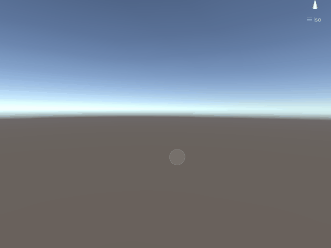
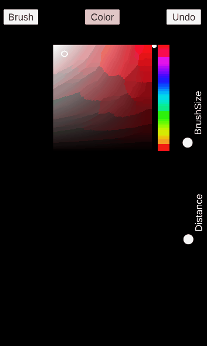

# AR-Brushes
## 3D Capsule Mesh Drawing using Unity3D AR Core
###### Features:
//demo imgs here
1. **Capsule mesh approach**
    - This demo generates pipe-shaped 3D mesh in runtime
    
2. **Color Picker Shader.**
    - Color picker is achieved by customed color picker shader
    
3. **Change Brushes**
    - Custom materials can be applied as brushes' style.
    
    

